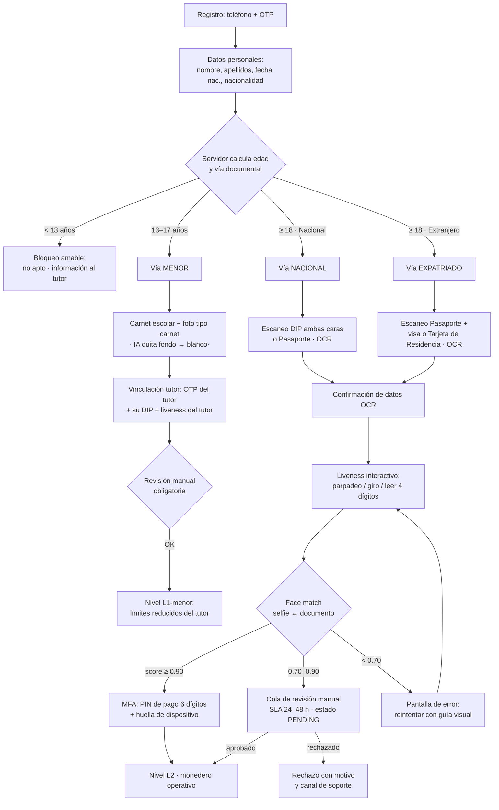

# KYC & AML — Especificación funcional y técnica · EG Route Plan (Monedero Virtual)

> Estado: **especificación aprobada para implementar tras la Auth unificada.**
> Paleta: la misma de `constants/colors.ts` (ya cumple los tokens pedidos).
> Estilo: formularios minimalistas tipo DiDi — poco texto, tarjetas suaves,
> progreso visible, un CTA azul por pantalla.

---

## 1. Principios de diseño (KYC adaptativo estilo super-app)

1. **El árbol de decisión lo calcula el SERVIDOR, no el cliente.** La app envía nacionalidad + fecha de nacimiento y el backend devuelve los documentos válidos y el nivel objetivo. Así nadie manipula el flujo desde el cliente (anti-tampering).
2. **Progresivo, no exhaustivo.** Se pide lo mínimo para cada nivel: L0 → L1 en < 2 min; L2 completo solo cuando el usuario necesita mover dinero.
3. **Nunca una foto estática como prueba.** Liveness interactivo obligatorio (parpadeo / giro de cabeza / lectura de 4 dígitos aleatorios).
4. **El OCR escribe, el usuario confirma.** Autorrelleno con edición manual siempre disponible (evita errores de tipeo sin perder control).
5. **Todo dato biométrico/documental es secreto de nivel 1:** cifrado en reposo, hash para índices, retención limitada, jamás en logs.

---

## 2. Diagrama de flujo lógico



Estados de la verificación: `NOT_STARTED → IN_PROGRESS → PENDING_REVIEW → VERIFIED | REJECTED | EXPIRED` (documento caducado → refresco anual para L2, semestral para menores).

---

## 3. Niveles de verificación y límites de transacción (reglas de negocio)

Coherente con la regla dura ya implementada del monedero (**100.000 XAF/día y por operación** como techo regulatorio interno):

| Nivel | Requisitos | Saldo máx. | Límite diario | Pago/escrow | Retirada agente | P2P |
|---|---|---|---|---|---|---|
| **L0** Sin verificar | Teléfono + OTP | 0 (sin monedero) | 0 | ❌ | ❌ | ❌ |
| **L1** Básico | L0 + datos + doc escaneado (sin biometría validada) | 50.000 XAF | 20.000 XAF | ✅ ≤ 20.000/op | ❌ | ❌ |
| **L1-menor** (13–17) | Carnet escolar + tutor L2 vinculado | 30.000 XAF | 10.000 XAF | ✅ ≤ 10.000/op, visible al tutor | ❌ | ❌ |
| **L2** Verificado | Doc OCR validado + liveness + face match ≥ 0.90 | 500.000 XAF | **100.000 XAF** | ✅ completo | ✅ con justificación AML | ❌ (nunca) |
| **L3** Verificado+ | L2 + revisión manual (agentes, comercios, casos excepcionales) | 2.000.000 XAF | 100.000 XAF (techo legal) | ✅ completo | ✅ | ❌ |

Reglas AML adicionales:
- **Sin P2P** en ningún nivel (ya estructural en `transactions.tx_shape_chk`).
- Escalado de nivel: inmediato al aprobar cada etapa; el monedero consulta el nivel en cada operación vía `kyc_profiles.level` (cache 60 s máx.).
- **Vencimiento**: L2 expira si el documento caduca → degrada a L1 con aviso 30/7/1 días antes.
- L1-menor se convierte en L1 al cumplir 18 con notificación para completar L2.
- Alertas AML automáticas: ≥ 3 cuentas por dispositivo (`device_fingerprints`), ≥ 2 identidades por doc_number_hash, actividad geográfica imposible (dos países < 2 h).

---

## 4. Biometría y detección de vitalidad

| Capa | Especificación |
|---|---|
| Desafío | 2 gestos aleatorios de {parpadeo 2×, giro izq./der., sonrisa} **o** lectura de 4 dígitos aleatorios en pantalla (anti-replay: el desafío lo firma el servidor con TTL 90 s) |
| Captura | Secuencia de vídeo corta (≤ 3 s) o ráfaga de 8–12 frames; nunca una sola foto |
| Face match | Selfie mejor ↔ foto del documento; umbral aprobado 0.90, revisión 0.70–0.90, rechazo < 0.70 |
| Foto carnet (menores) | Segmentación selfie on-device (ML Kit) → fondo blanco automático, tanto en vivo como desde galería |
| Anti-spoofing extra | Análisis de moiré/pantalla (foto de foto), textura de piel, consistencia de iluminación entre frames; proveedor Fase 2 (FaceTec/iProov) enchufable |

Proveedores (capa de abstracción `BiometryProvider` con interfaz única):
- **Fase 1 (sin coste):** ML Kit on-device (face detection + OCR del documento — el PII no sale del dispositivo para OCR) + face match servidor (AWS Rekognition `CompareFaces` o equivalente).
- **Fase 2:** proveedor certificado ISO 30107-3 si el volumen de fraude lo justifica.

---

## 5. MFA y protocolo de recuperación

**Creación inicial (fin del KYC L2):**
1. PIN de pago (6 dígitos, Argon2id, 5 intentos → bloqueo 15 min — ya implementado en el monedero).
2. PIN de acceso (login) — puede ser el mismo con scopes distintos o separado (recomendado: separado).
3. Teléfono vinculado con OTP (ya implementado).

**Cambio de PIN o de teléfono (MFA estricto, en este orden):**
```
OTP al número actual  →  Liveness interactivo  →  Escaneo del documento original
        ↓ cada paso con su error específico y contador global de 3 intentos/día
```
**Teléfono perdido:** Liveness + documento + **revisión manual** (cola soporte, SLA 24–48 h). Mientras dura la revisión: monedero en solo-lectura (sin salidas), aviso por canal alternativo (email si existe). Nunca se revela si la cuenta existe (anti-enumeración).

---

## 6. Device Fingerprinting (seguridad contextual)

Se recopila en registro, login y cada operación de dinero (con consentimiento en la primera pantalla):

| Dato | Fuente | Uso anti-fraude |
|---|---|---|
| `device_id` (hash) | expo-application / expo-device | ≥ 3 cuentas/dispositivo → revisión |
| Modelo, SO, build | expo-device | Anomalías de emulador |
| IP + ASN | servidor | País IP vs GPS vs SIM |
| GPS (opcional) | expo-location (foreground) | Geografía imposible |
| Root/jailbreak | comprobaciones heurísticas (archivos de su, Magisk, Cydia) | Flag de riesgo → exige L2 para operar |
| Emulador | heurística build props | Bloqueo de registro en emulador |

Tabla: `mobility.device_fingerprints` — todo se almacena con hash (nunca IDs en claro) + `risk_score` calculado en servidor.

---

## 7. Modelo de datos (schema `mobility`)

```sql
mobility.kyc_profiles (
  user_id UUID PK FK → mobility.users,
  level SMALLINT NOT NULL DEFAULT 0 CHECK (level BETWEEN 0 AND 3),
  status kyc_status NOT NULL DEFAULT 'NOT_STARTED',
  nationality VARCHAR(2),              -- ISO-3166 alpha-2 ('GQ', 'ES', 'CN'…)
  birth_date DATE,
  doc_type kyc_doc_type,               -- DIP | PASSPORT | RESIDENCE_CARD | SCHOOL_ID
  doc_number_hash TEXT,                -- sha256(doc_number + pepper), nunca en claro
  doc_expires_at DATE,
  face_match_score NUMERIC(5,4),
  tutor_user_id UUID REFERENCES mobility.users,   -- solo menores
  reviewed_by UUID, reviewed_at TIMESTAMPTZ,
  rejection_reason TEXT,
  created_at, updated_at TIMESTAMPTZ
)

mobility.kyc_documents (
  id UUID PK, user_id FK, doc_type, side VARCHAR(8),  -- front | back | selfie | photo_id
  storage_url TEXT NOT NULL,          -- objeto cifrado (KMS); nunca URL pública
  ocr_payload JSONB,                  -- campos extraídos + confianza por campo
  created_at TIMESTAMPTZ
)

mobility.biometric_proofs (
  id UUID PK, user_id FK, method VARCHAR(24),  -- BLINK | TURN | READ_DIGITS
  liveness_score NUMERIC(5,4), challenge_hash TEXT,
  created_at TIMESTAMPTZ
)

mobility.device_fingerprints (
  id UUID PK, user_id FK, device_id_hash TEXT,
  platform VARCHAR(12), os_version VARCHAR(24), model VARCHAR(60),
  ip INET, gps_lat NUMERIC(10,7), gps_lng NUMERIC(10,7),
  is_rooted BOOLEAN, is_emulator BOOLEAN, risk_score SMALLINT,
  created_at TIMESTAMPTZ, UNIQUE (user_id, device_id_hash)
)

mobility.kyc_events (                 -- auditoría inmutable
  id UUID PK, user_id FK, from_status, to_status,
  actor VARCHAR(12),                  -- USER | SYSTEM | REVIEWER
  note TEXT, created_at TIMESTAMPTZ
)
```

---

## 8. Endpoints (backend unificado, módulo mobility)

| Método | Ruta | Auth | Descripción |
|---|---|---|---|
| GET | `/v1/mobility/kyc/status` | JWT | `{ level, status, expiresAt, requiredAction? }` |
| POST | `/v1/mobility/kyc/profile` | JWT | Paso 1: `{ fullName, birthDate, nationality }` → **servidor devuelve vía documental + opciones válidas** |
| POST | `/v1/mobility/kyc/documents` | JWT | Upload doc (multipart cifrado) → OCR async; idempotente por `doc_type+side` |
| GET | `/v1/mobility/kyc/documents/:id/ocr` | JWT | Resultado OCR para autorrelleno |
| POST | `/v1/mobility/kyc/biometry/challenge` | JWT | Emite desafío firmado (2 gestos o 4 dígitos, TTL 90 s) |
| POST | `/v1/mobility/kyc/biometry` | JWT | Verifica liveness + face match → score |
| POST | `/v1/mobility/kyc/complete` | JWT | Evaluación final → asigna `level` (L1/L2/L1-menor) |
| POST | `/v1/mobility/kyc/tutor-link` | JWT del tutor | Vinculación de menor (OTP + doc tutor) |
| POST | `/v1/mobility/kyc/recovery/start` | OTP | Inicia recuperación (PIN/teléfono) |
| POST | `/v1/mobility/kyc/recovery/verify` | — | MFA completo (liveness+doc) o escalado a revisión |
| GET | `/v1/mobility/admin/kyc/queue` | ADMIN | Cola de revisión manual |
| POST | `/v1/mobility/admin/kyc/:userId/review` | ADMIN | Aprobar/rechazar con motivo (kyc_events) |

Rate limiting: 5/min en uploads y biometría; 3/día en recuperación; contador global por `device_id_hash`.

---

## 9. Especificación UX/frontend (React Native)

**Componentes a construir (reutilizan tokens y tema existentes):**

| Componente | Spec clave |
|---|---|
| `KycProgressBar` | 4–5 segmentos, azul `primary` (`#0066CC`) el completado/activo; visible en TODAS las pantallas del flujo |
| `StepHeader` | Título corto (máx. 5 palabras) + subtítulo de 1 línea; nada de párrafos |
| `FormField` | Borde redondeado 14 px, foco azul primario, error rojo con mensaje de 1 línea; fondo `#F5F7FA` |
| `DocumentChoiceTree` | Renderiza las opciones que devuelve el servidor (tarjetas con icono + 1 línea); nunca opciones inválidas atenuadas: se ocultan |
| `DocumentScanScreen` | Marco guía con esquinas azules, detección de documento en vivo (ML Kit), flash automático en baja luz, captura front→back en 2 pasos |
| `SelfieLivenessScreen` | Óvalo guía, instrucción animada del desafío (parpadea/gira/lee), barra de progreso de captura, fondo blanco automático para carnet |
| `OtpInput` / `PinPad` | Reutilizar patrón del monedero web (6 celdas), teclado numérico nativo |
| `KycResultScreen` | Estados: éxito (verde, check animado), pendiente (naranja, SLA 24–48 h), error (rojo, causa + botón reintentar) |
| `RecoveryFlow` | 3 pasos secuenciales con la misma progress bar; estado de bloqueo temporal visible |

**Reglas visuales obligatorias:** un solo CTA azul por pantalla; acciones secundarias solo texto/borde; espaciado ≥ 16 px; contraste WCAG AA verificado en sol directo; modo oscuro vía `useTheme()` (ya mapeado); cero decoración; mensajes de error de máx. 2 líneas con acción clara.

**Accesibilidad:** `accessibilityLabel` en todos los controles, tamaños táctiles ≥ 44 pt, soporte Dynamic Type.

---

## 10. Roadmap de implementación (orden aprobado)

1. **Fase A — Auth unificada RN** (1ª iteración): login/registro contra `mobility.users`, OTP por Twilio (credenciales ya presentes en la infraestructura), PIN de acceso, `expo-secure-store`. Produce los primitivos (`OtpInput`, `PinPad`, `FormField`, `StepHeader`).
2. **Fase B — KYC engine** (esta especificación): tablas, endpoints, OCR on-device, liveness, niveles y límites conectados al monedero.
3. **Fase C — Monedero en la app RN** (gate `level ≥ L2`).
4. **Fase D — Órdenes de movilidad** con pago wallet/escrow.
